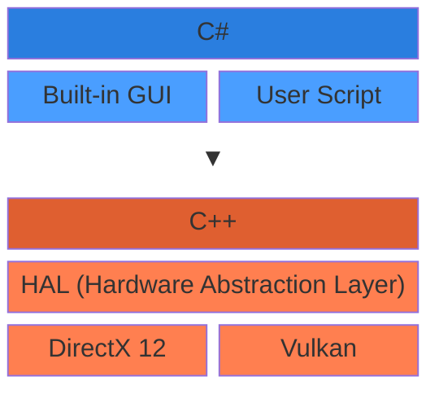
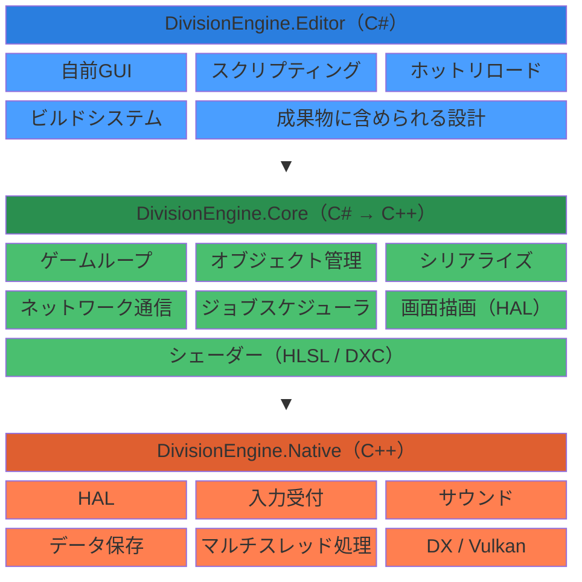

# DivisionEngine

A repository for developing an original game engine from scratch.

The goal of this project is **not** to build a production-ready engine, but to **learn through the process** of game engine development. As such:

- Commits that merely "get things done" without demonstrating understanding will not be accepted.
- Every feature implementation must be accompanied by documentation summarizing the research and findings behind it.
- Research documents are maintained in a separate repository: https://github.com/Division-Technologies/DivisionNotes

## Architecture
### Design Principles
- Graphics abstraction: Graphics APIs are accessed through a Hardware Abstraction Layer (HAL), supporting both DirectX 12 and Vulkan.
- Built-in GUI framework: A custom GUI framework is embedded within the C# engine layer. Engine-level GUI (e.g. debug overlays) is included in the build output, so debug screens are automatically available in every build.
- Platform: Windows is the primary target. Multi-platform support is planned for the future.

### Layer Design

### Layer Structure

---

## 日本語

オリジナルのゲームエンジンをゼロから開発するリポジトリです。

本プロジェクトの目的は、完成されたエンジンを作ることでは**ありません**。ゲームエンジン開発を通して**学びを得ること**を目的としています。

- 完成を優先するだけのコミットは受け入れません
- 機能を実装する際は、必ず調査結果をドキュメントにまとめる必要があります
- 調査ドキュメントは別リポジトリで管理しています：https://github.com/Division-Technologies/DivisionNotes

### 設計方針
- グラフィック抽象化：グラフィックAPIはHAL（ハードウェア抽象化レイヤー）を介してアクセスし、DirectX 12 と Vulkan の両方をサポートします。
- 自前GUIフレームワーク：C#エンジンレイヤー内に独自のGUIフレームワークを内包します。エンジン部分のGUI（デバッグ画面等）はビルド成果物に含まれ、すべてのビルドでデバッグ画面が自動的に付随します。
- プラットフォーム：まず Windows を対象とし、将来的にマルチプラットフォーム対応を目指します。
